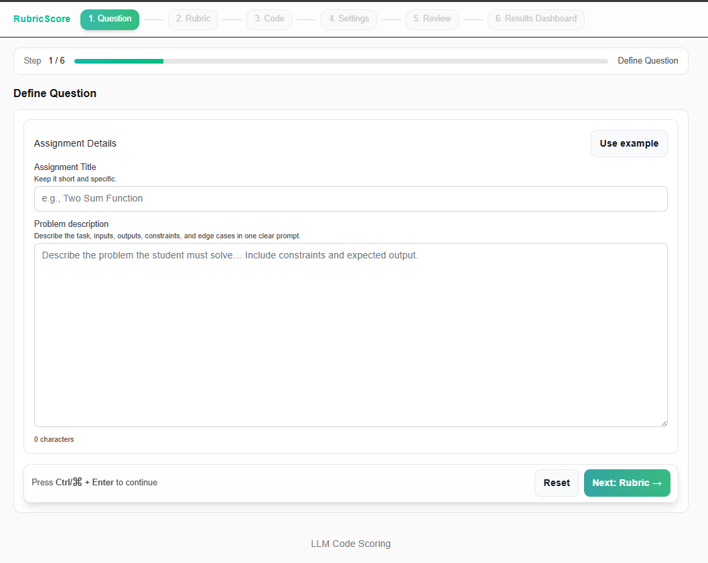
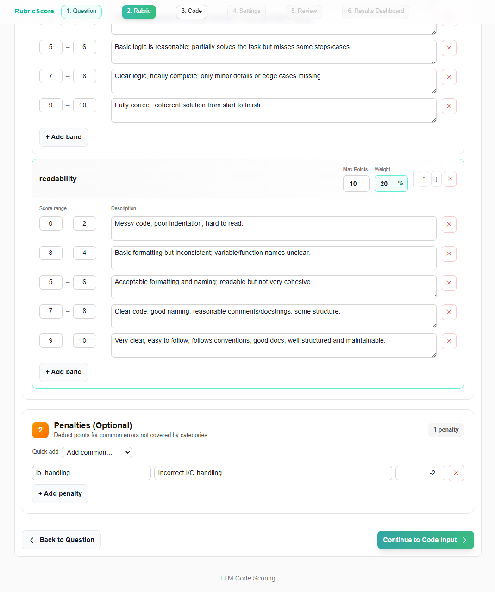
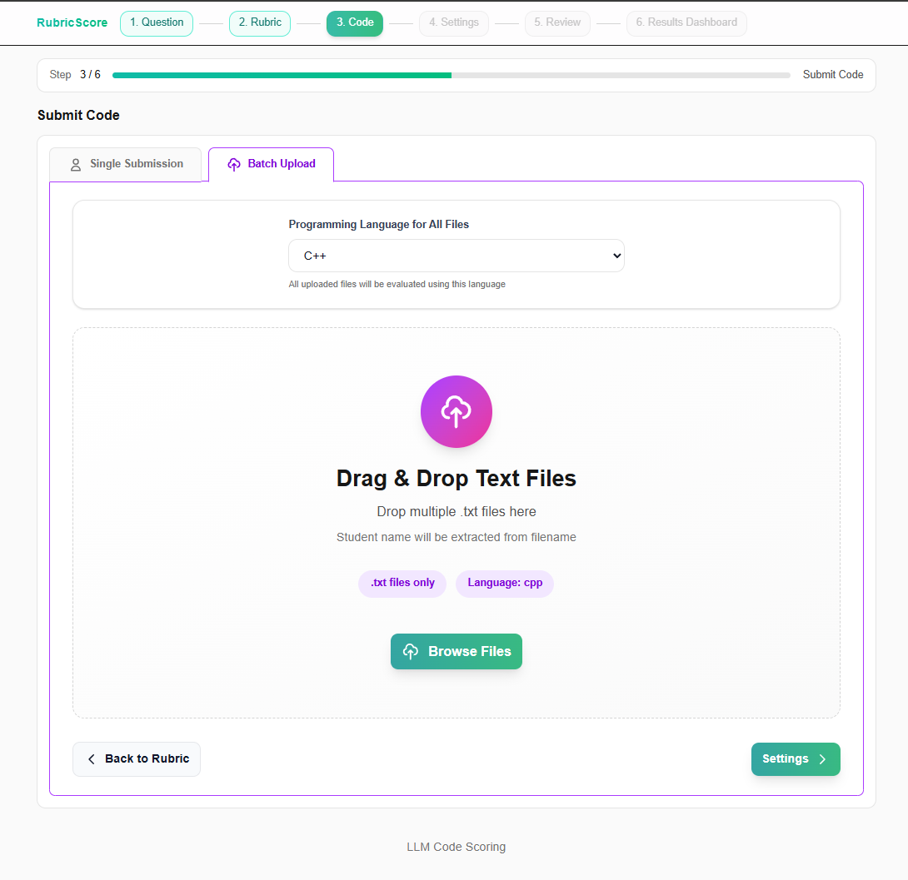
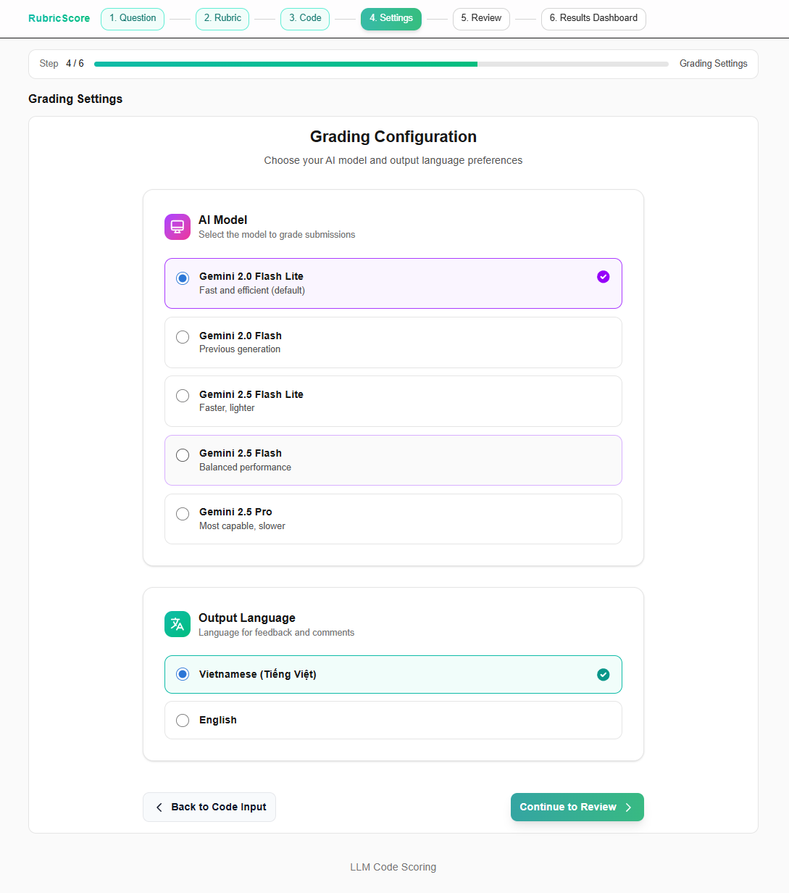
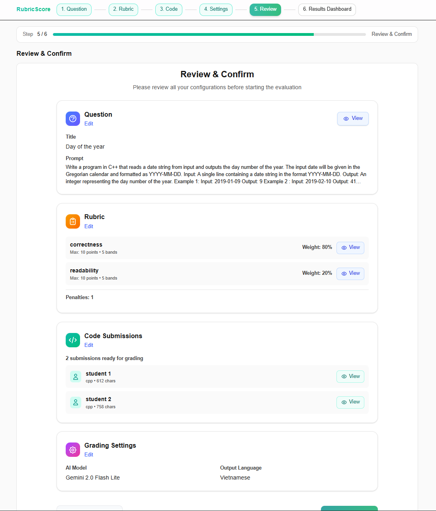
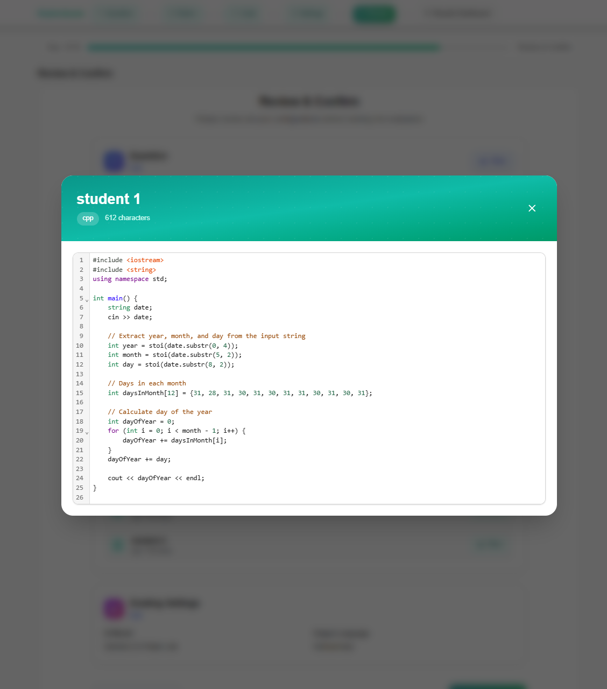

# LLM Code Scoring System

An automated code grading system powered by Large Language Models (LLMs) for evaluating student programming assignments. The system provides a complete solution with a FastAPI backend and a modern Next.js frontend interface.



## Overview

This project enables educators to:

- Define programming questions with detailed rubrics
- Submit student code for automated evaluation
- Receive AI-generated scores and feedback
- Support multiple programming languages
- Export results in various formats

The system leverages state-of-the-art LLMs (Gemini, OpenAI, DeepSeek, Grok, LM Studio, Ollama) to provide consistent, detailed, and educational feedback on code submissions.

## Features

### Rubric-Based Grading

- Define custom scoring categories with weights
- Flexible score bands with descriptions
- Support for penalty deductions
- Automatic weight validation

### Multi-Language Support

- Python
- JavaScript/TypeScript
- C++
- Java
- Extensible for additional languages

### LLM Provider Support

- **Google Gemini**: 2.0/2.5 Flash, Pro models
- **OpenAI**: GPT-3.5, GPT-4 series
- **DeepSeek**: DeepSeek models
- **Grok**: xAI models
- **LM Studio**: Local model hosting
- **Ollama**: Local open-source models

### Batch Processing

- Upload multiple submissions at once
- Process files from TXT format
- Real-time progress tracking
- Concurrent grading with status updates

### Results and Export

- Detailed score breakdowns by category
- AI-generated feedback and comments
- Export to CSV or JSON
- Individual submission review

## Workflow

The application follows a guided 6-step workflow to ensure accurate and consistent grading.

### 1. Define Question

Set up the programming problem with constraints and expected format.


### 2. Define Rubric

Build scoring categories with weights and score bands.



### 3. Submit Code

Upload student code (single or batch) for evaluation.



### 4. Grading Settings

Select the AI model and configure output preferences.



### 5. Review and Confirm

Validate all settings before starting the grading process.



### 6. Results

View detailed scores, feedback, and export the data.



## Quick Start

### Prerequisites

**Backend**

- Python 3.10 or higher
- Conda (recommended) or pip
- API keys for chosen LLM provider(s)

**Frontend**

- Node.js 20.x or higher
- npm 10.x or higher

### Installation

#### 1. Backend Setup

```bash
cd Backend

# Create conda environment
conda env create -f environment.yml
conda activate llm-code-scoring

# Or use pip
pip install -r requirements.txt

# Configure environment
cp .env.example .env
# Edit .env with your API keys
```

#### 2. Frontend Setup

```bash
cd Frontend/fe-code-scoring

# Install dependencies
npm install

# Configure environment
echo "NEXT_PUBLIC_API_URL=http://localhost:8000" > .env.local
```

### Running the Application

#### Start Backend Server

```bash
cd Backend
conda activate llm-code-scoring

# Development
uvicorn app.main:app --reload --port 8000

# Production
gunicorn app.main:app -w 4 -k uvicorn.workers.UvicornWorker --bind 0.0.0.0:8000
```

#### Start Frontend Server

```bash
cd Frontend/fe-code-scoring

# Development
npm run dev

# Production
npm run build
npm start
```

Access the application at `http://localhost:3000`

## Configuration

### Backend Environment Variables

Create a `.env` file in the `Backend/` directory:

```env
# Required: Choose your LLM provider(s)
GEMINI_API_KEY=your_gemini_api_key
OPENAI_API_KEY=your_openai_api_key
DEEPSEEK_API_KEY=your_deepseek_api_key
GROK_API_KEY=your_grok_api_key

# Optional: Model selection
GEMINI_MODEL=gemini-2.0-flash-lite
OPENAI_MODEL=gpt-4o-mini

# Optional: Local providers
LMSTUDIO_BASE_URL=http://localhost:1234/v1
OLLAMA_BASE_URL=http://localhost:11434

# Server configuration
LOG_LEVEL=INFO
CORS_ORIGINS=http://localhost:3000
```

### Frontend Environment Variables

Create a `.env.local` file in the `Frontend/fe-code-scoring/` directory:

```env
NEXT_PUBLIC_API_URL=http://localhost:8000
```

## API Documentation

### POST /score

Score a student's code submission against a rubric.

**Endpoint**: `POST /score`

**Request Body**:

```json
{
  "llm_provider": "gemini",
  "problem_description": "Write a function to compute factorial",
  "student_code": "def factorial(n):\n    return 1 if n <= 1 else n * factorial(n-1)",
  "programming_language": "python",
  "rubric": {
    "categories": [
      {
        "name": "correctness",
        "max_points": 10,
        "weight": 0.7,
        "bands": [
          { "min_score": 0, "max_score": 4, "description": "Incorrect logic" },
          { "min_score": 5, "max_score": 8, "description": "Mostly correct" },
          { "min_score": 9, "max_score": 10, "description": "Fully correct" }
        ]
      },
      {
        "name": "code_quality",
        "max_points": 10,
        "weight": 0.3,
        "bands": [
          { "min_score": 0, "max_score": 5, "description": "Poor quality" },
          { "min_score": 6, "max_score": 10, "description": "Good quality" }
        ]
      }
    ]
  },
  "language": "English"
}
```

**Response**:

```json
{
  "final_score": 8.5,
  "category_scores": {
    "correctness": { "raw_score": 9.0, "weighted_score": 6.3 },
    "code_quality": { "raw_score": 7.0, "weighted_score": 2.1 }
  },
  "feedback": "The solution correctly implements factorial...",
  "comments": "Consider adding input validation..."
}
```

See `Backend/API.md` for complete API documentation.

## Project Structure

### Backend Structure

```
Backend/
├── app/
│   ├── api/                    # API endpoints
│   │   └── routes/
│   │       └── scoring.py      # /score endpoint
│   ├── core/                   # Core configuration
│   │   ├── config.py           # Settings management
│   │   └── logging_config.py   # Logging setup
│   ├── models/                 # Pydantic models
│   │   ├── request.py          # Request schemas
│   │   └── response.py         # Response schemas
│   ├── services/               # Business logic
│   │   └── llm_services/       # LLM integrations
│   │       ├── gemini_service.py
│   │       ├── openai_service.py
│   │       └── ...
│   └── main.py                 # Application entry
├── tests/                      # Test suite
├── requirements.txt            # Python dependencies
└── environment.yml             # Conda environment
```

### Frontend Structure

```
Frontend/fe-code-scoring/
├── src/
│   ├── app/                    # Next.js App Router
│   │   ├── layout.tsx
│   │   ├── page.tsx
│   │   └── globals.css
│   ├── components/             # React components
│   │   ├── QuestionForm.tsx
│   │   ├── RubricBuilder.tsx
│   │   ├── CodeInput.tsx
│   │   ├── BatchUpload.tsx
│   │   ├── GradingSettings.tsx
│   │   ├── ReviewConfirm.tsx
│   │   ├── Results.tsx
│   │   └── Stepper.tsx
│   ├── services/               # API integration
│   │   └── gradingService.ts
│   ├── state/                  # State management
│   │   └── appState.tsx
│   └── types/                  # TypeScript types
│       └── index.ts
├── package.json
└── tsconfig.json
```

## Security Considerations

- Store API keys in environment variables, never in code
- Use HTTPS in production
- Implement rate limiting for API endpoints
- Validate and sanitize all user inputs
- Keep dependencies updated
- Use secure CORS configuration

## Acknowledgments

- Built with FastAPI and Next.js
- Powered by Google Gemini, OpenAI, and other LLM providers
- Uses CodeMirror for code editing
- Styled with TailwindCSS
